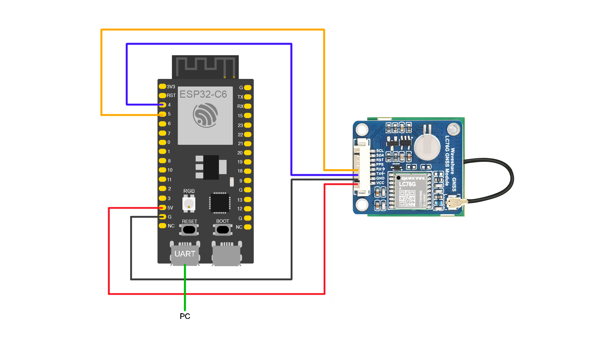
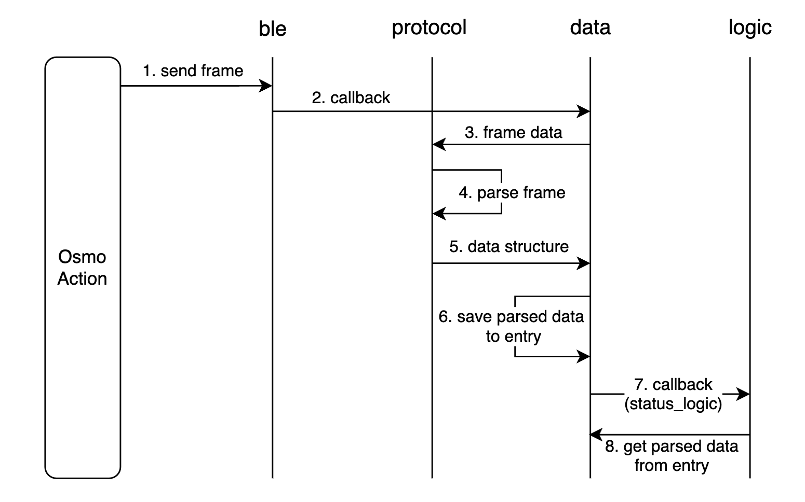

# Osmo Action GPS Bluetooth Remote Controller (ESP32-C6-Example)

  

<p align="center">
  <br>English | <a href="README_CN.md">中文</a>
</p>

## Introduction

This project provides a set of code running on the ESP32-C6 development board (based on the ESP-IDF framework), demonstrating how to parse, process, and send the DJI R SDK protocol to control the camera. The example program implements basic remote control functions, including: long-pressing the BOOT button to connect to the nearest (compatible) Osmo Action device, single-clicking to control recording, quickly switching modes, and pushing GPS data based on the LC76G GNSS module. Additionally, the program dynamically adjusts the RGB LED display based on the device's status.

## Key Features

- **Protocol Parsing**: The `protocol` layer demonstrates how to parse the DJI R SDK protocol.
- **GPS Data Push**: Collect GPS data at a 10Hz frequency using the LC76G GNSS module, parse it, and push it to the camera in real time.
- **Button Support**: Supports single-click (start/stop recording) and long-press (search for and connect to the nearest camera) operations.
- **RGB LED Support**: Monitors the system status in real time and dynamically adjusts the RGB LED color based on status changes.
- **Other Features**: Switch the camera to a specific mode, quick switch mode (QS), subscribe to camera status, query camera version, and more.

## Development Environment

**Software**: ESP-IDF v5.5

**Hardware**:

- ESP32-C6-WROOM-1
- LC76G GNSS Module
- DJI Osmo Action 5 Pro / DJI Osmo Action 4

The hardware connection involves the connection between the ESP32-C6-WROOM-1 and the LC76G GNSS Module. The specific connections are as follows:

- **ESP32-C6 GPIO5** connects to **LC76G RX**
- **ESP32-C6 GPIO4** connects to **LC76G TX**
- **ESP32-C6 5V** connects to **LC76G VCC**
- **ESP32-C6 GND** connects to **LC76G GND**

Please ensure that the pins are correctly connected, especially the TX and RX pins, to ensure proper data transmission.



## Quick Start

* Install the ESP-IDF toolchain. For installation steps, refer to the documentation below. We recommend installing the ESP-IDF extension for VSCode. You can download the plugin here: [ESP-IDF Plugin - VSCode](https://marketplace.visualstudio.com/items?itemName=espressif.esp-idf-extension)

* Next, check the `.vscode/settings.json` file in the project to ensure that the IDF-related parameters are configured correctly.

* After setting up the environment, compile and flash the code to the development board. Use the monitor to view real-time logs. You can check the current device state by observing the RGB light status on the development board: red indicates uninitialized, yellow indicates BLE initialization complete, and the device is ready.
- When the BOOT button is long-pressed, the RGB LED flashes blue, indicating that it is searching for and connecting to the nearest Osmo Action device. A steady blue light indicates that BLE is connected, a steady green light indicates that the protocol is connected and commands can be sent and received, and a steady purple light indicates that the protocol is connected and GPS signal is available.

- When the BOOT button is clicked, the camera starts or stops recording. During long recording sessions, the RGB LED will flash.

## Project Structure

```
├── ble              # Bluetooth device layer
├── data             # Data layer
├── logic            # Logic layer
├── protocol         # Protocol layer
├── main             # Main entry point
├── utils            # Utility functions
└── CMakeLists.txt   # Project build file
```

- **ble**: Responsible for BLE connection between the ESP32 and the camera, as well as data read/write operations.
- **protocol**: Responsible for encapsulating and parsing protocol frames, ensuring the correctness of data communication.
- **data**: Responsible for storing parsed data and providing an efficient read/write logic based on Entries for the logic layer to use.
- **logic**: Implements specific functionalities, such as requesting connections, button operations, GPS data processing, camera status management, command sending, light control, etc.
- **utils**: Utility class used for tasks like CRC checking.
- **main**: The entry point of the program.

## Protocol Parsing

The following diagram illustrates the general process of frame parsing in the program:



For detailed documentation, please refer to: [Protocol Parsing Documentation](docs/protocol.md)

### Data Layer

The data layer acts as an intermediary for sending and receiving frames and defines an array `s_entries` with a size of 10. Each entry includes fields such as `seq`, `is_seq_based`, `cmd_set`, `cmd_id`, and `parse_result`. It also implements two mechanisms for removal: LRU and timed deletion, ensuring that the data layer remains available within limited space.

The data layer provides two data read/write interfaces: `data_write_with_response` and `data_write_without_response`.

When calling `data_write_with_response`, an entry is allocated to receive the parsed result, and then `data_wait_for_result_by_seq` must be called to retrieve the result.

Why is `data_wait_for_result_by_cmd` necessary? In some cases, such as in `connect_logic`, when the camera is connected, it may actively send a command frame to the remote control. At this point, `seq` is not defined by us, so the result must be retrieved using `CmdSet` and `CmdID`.

Additionally, the `receive_camera_notify_handler` function is defined as a callback function called by the BLE layer to process commands sent by the camera.

For more details, please refer to the `data.c` source code.

### GPS Data Push Example

The GNRMC and GNGGA data from the LC76G GNSS module supports a maximum update frequency of 10Hz, provided that we send the corresponding command to the module:

```c
// "$PAIR050,1000*12\r\n" for 1Hz update rate
// "$PAIR050,500*26\r\n" for 5Hz update rate
// "$PAIR050,100*22\r\n" for 10Hz update rate
char* gps_command = "$PAIR050,100*22\r\n";  // (>1Hz only RMC and GGA supported)
uart_write_bytes(UART_GPS_PORT, gps_command, strlen(gps_command));
```

When parsing a large number of such strings to obtain latitude, longitude, speed components, and other information, invalid data needs to be filtered out, and methods for data correction and accuracy improvement can be applied. Due to the frequent parsing process, attention must be paid to the watchdog timeout during task execution, so the program uses `vTaskDelay` appropriately to reset the watchdog. This program uses a simple parsing method for data push demonstration; please refer to the `Parse_NMEA_Buffer` and `gps_push_data` functions in `gps_logic`.

When GPS signal is available (indicated by a steady purple RGB light), recording starts. After stopping the recording, you can view the corresponding data on the dashboard in the DJI Mimo APP.

## How to Add a Feature

**Before adding a feature, please make sure you have thoroughly read the Protocol Parsing Documentation and understand the workings of the data layer.**

### Adding New Command Support

When sending or parsing command and response frames, you only need to follow three simple steps:

- Define the frame structure in `dji_protocol_data_structures`.

- Define the triple in `dji_protocol_data_descriptors` and provide the corresponding `creator` and `parser`. If not implemented, you can set them to `NULL`. If the parser function cannot find the corresponding `creator` or `parser`, the process of constructing or parsing the frame will stop.

- In the logic layer (`logic`), define the corresponding function, write the business logic, and call the `send_command` function in the command logic (`command_logic`).

If you add a new `.c` file in the logic layer, make sure to modify the `main/CMakeLists.txt` file.

Regarding the `send_command` function, you need to know that: in addition to passing `CmdSet`, `CmdID`, and the frame structure, you also need to pass `CmdType`, which is the frame type, defined in `enums_logic`:

```c
typedef enum {
    CMD_NO_RESPONSE = 0x00,      // Command frame - No response required after sending data
    CMD_RESPONSE_OR_NOT = 0x01,  // Command frame - Response required, no error if not received
    CMD_WAIT_RESULT = 0x02,      // Command frame - Response required, error if not received

    ACK_NO_RESPONSE = 0x20,      // Response frame - No response required (00100000)
    ACK_RESPONSE_OR_NOT = 0x21,  // Response frame - Response required, no error if not received (00100001)
    ACK_WAIT_RESULT = 0x22       // Response frame - Response required, error if not received (00100010)
} cmd_type_t;
```

Therefore, to support the creation of a command or response frame, the creation function should be implemented in the `creator`; to support parsing, the parsing function should be written in the `parser`.

Additionally, the `send_command` function will decide whether to block and wait for data return based on the frame type, which is suitable for both send-receive and send-only scenarios. If direct data reception is required, the `data_wait_for_result_by_cmd` function should be called.

### Modifying Callback Functions

This program mainly uses callback functions in the following places:

- **data** layer: `receive_camera_notify_handler`: Called after receiving a BLE notification to receive the data sent by the camera.

- In **status_logic**: `update_camera_state_handler`: Called by `data.c`'s `receive_camera_notify_handler` to update the camera's status information.

- In **connect_logic**: `receive_camera_disconnect_handler`: Called after a BLE disconnect event to handle unexpected reconnections and active disconnections, as well as state changes.

- In **light_logic**: `led_state_timer_callback` and `led_blink_timer_callback`: Used to control the RGB LED display based on corresponding state changes (the default timer priority is 1).

### Defining Button Functions

In `key_logic`, long-press and single-click events are configured for the BOOT button, with corresponding logic operations implemented. More buttons and functions can be added here. The button scanning task is configured with a priority of 2. It is important to adjust the priority appropriately if other frequently executed tasks exist, as improper priority configuration may lead to unresponsive or non-functional buttons.

### Adding Sleep Function Example

After reading the documentation above, you can try adding a new feature: putting the camera to sleep mode with a single click of the BOOT button.

For detailed implementation, please refer to: [Add Camera Sleep Feature Example Documentation](docs/add_camera_sleep_feature_example.md)

## Reference Documents

For a more comprehensive understanding of the project, refer to the following documents:

- **ESP-IDF**：[ESP-IDF Official GitHub Repository](https://github.com/espressif/esp-idf/)

- **LC76G GNSS Module**：[LC76G GNSS Module - Waveshare Wiki](https://www.waveshare.com/wiki/LC76G_GNSS_Module)

- **ESP32-C6-WROOM-1**：[ESP32-C6-DevKitC-1 v1.2 - ESP32-C6 User Guide](https://docs.espressif.com/projects/esp-dev-kits/en/latest/esp32c6/esp32-c6-devkitc-1/user_guide.html)

## About PR

The DJI development team is dedicated to enhancing your development experience and welcomes your contributions. However, please note that PR code reviews may take some time. If you have any questions, feel free to contact us via email.
