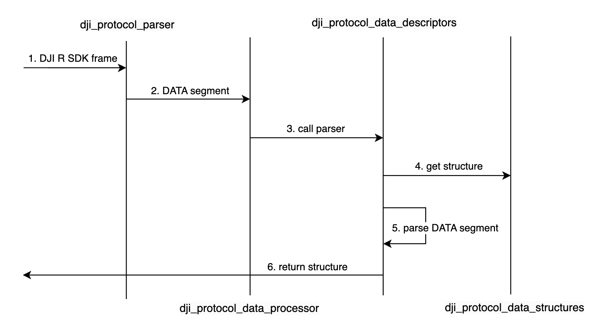

# Protocol Parsing Documentation

## What is the DJI R SDK Protocol?

This protocol is used for communication with the DJI Osmo Action 5 Pro / DJI Osmo Action 4. The frame structure is as follows:

```
|  SOF   | Ver/Length | CmdType |  ENC   |  RES   |  SEQ   | CRC-16 |  DATA  | CRC-32 |
|------- |------------|---------|--------|--------|--------|--------|--------|--------|
| 1-byte |   2-byte   | 1-byte  | 1-byte | 3-byte | 2-byte | 2-byte | n-byte | 4-byte |
```

Here, the CRC-16 value is the result of performing CRC16 checksum on the segment from SOF to SEQ, and the CRC-32 value is the result of performing CRC32 checksum on the segment from SOF to DATA.

## DATA Segment

The core of this program lies in the encapsulation and parsing of the DATA payload. Although the length of the DATA payload is variable, the first two bytes are always CmdSet and CmdID, as shown in the structure below:

```
|  CmdSet  |  CmdID   |  Data Payload  |
|----------|----------|----------------|
|  1-byte  |  1-byte  |     n-byte     |
```

## Protocol Layer

The protocol layer is a separate module in this program designed to facilitate the parsing of protocol frames. The file structure is as follows:

```
protocol/
├── dji_protocol_data_descriptors.c
├── dji_protocol_data_descriptors.h
├── dji_protocol_data_processor.c
├── dji_protocol_data_processor.h
├── dji_protocol_data_structures.c
├── dji_protocol_data_structures.h
├── dji_protocol_parser.c
└── dji_protocol_parser.h
```

- **dji_protocol_parser**: Responsible for the encapsulation and parsing of the DJI R SDK protocol frames.
- **dji_protocol_data_processor**: Responsible for the encapsulation and parsing of the DATA payload.
- **dji_protocol_data_descriptors**: Defines a triple (CmdSet, CmdId) - creator - parser for each function to facilitate functionality expansion.
- **dji_protocol_data_structures**: Defines structures for command frames and response frames.



The image above demonstrates how the protocol layer parses the DJI R SDK frames, and the assembly process is similar.

When the DJI R SDK protocol remains unchanged, you do not need to modify `dji_protocol_parser`. Similarly, `dji_protocol_data_processor` does not require modification, as it calls the generic `creator` and `parser` methods defined in `dji_protocol_data_descriptors`:

```c
typedef uint8_t* (*data_creator_func_t)(const void *structure, size_t *data_length, uint8_t cmd_type);
typedef int (*data_parser_func_t)(const uint8_t *data, size_t data_length, void *structure_out, uint8_t cmd_type);
```

Therefore, when adding new functionality parsing, simply define the frame structure in `dji_protocol_data_structures`, add the corresponding `creator` and `parser` functions in `dji_protocol_data_descriptors`, and include them in the `data_descriptors` triple.

Below are the command functions currently supported by this program:

```c
/* Structure support, but need to define creator and parser for each structure */
const data_descriptor_t data_descriptors[] = {
    // Camera mode switch
    {0x1D, 0x04, (data_creator_func_t)camera_mode_switch_creator, (data_parser_func_t)camera_mode_switch_parser},
    // Version query
    {0x00, 0x00, NULL, (data_parser_func_t)version_query_parser},
    // Record control
    {0x1D, 0x03, (data_creator_func_t)record_control_creator, (data_parser_func_t)record_control_parser},
    // GPS data push
    {0x00, 0x17, (data_creator_func_t)gps_data_creator, (data_parser_func_t)gps_data_parser},
    // Connection request
    {0x00, 0x19, (data_creator_func_t)connection_data_creator, (data_parser_func_t)connection_data_parser},
    // Camera status subscription
    {0x1D, 0x05, (data_creator_func_t)camera_status_subscription_creator, NULL},
    // Camera status push
    {0x1D, 0x02, NULL, (data_parser_func_t)camera_status_push_data_parser},
    // Key report
    {0x00, 0x11, (data_creator_func_t)key_report_creator, (data_parser_func_t)key_report_parser},
};
```

For detailed protocol documentation, please contact DJI personnel.
